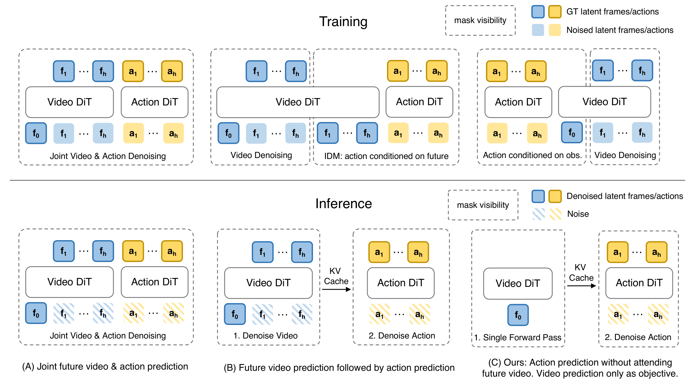

**Link**: https://arxiv.org/abs/2603.16666
**Authors**: [Tianyuan Yuan](https://arxiv.org/search/cs?searchtype=author&query=Yuan,+T), [Zibin Dong](https://arxiv.org/search/cs?searchtype=author&query=Dong,+Z), [Yicheng Liu](https://arxiv.org/search/cs?searchtype=author&query=Liu,+Y), [Hang Zhao](https://arxiv.org/search/cs?searchtype=author&query=Zhao,+H)
## Problems
- World Action Models are a better alternative to VLA's because they are trained to predict how visual observations *may* evolve with actions.
- WAM's typically *imagines* scenarios, then executes. This incurs quite a bit of computational overhead.
- They try to find if this future imagination part is necessary for accuracy.
- They disentangle training and test-time. During training it is going to have the video co-training, but skipped during test. Their model is competitive with world action models. They are 4x faster than SOTA WAM's.

Joint learning WAM's predict video and action together during training. They do the same in test time too. Causal WAM's predict video first, then condition action prediction using those generated frames. During test-time, they first generate future frames, and use them to generate actions. 

Fast-WAM first does the joint-training style training. Then during test-time behaves *like* a causal WAM.  Not exactly, but yeah.

[
]