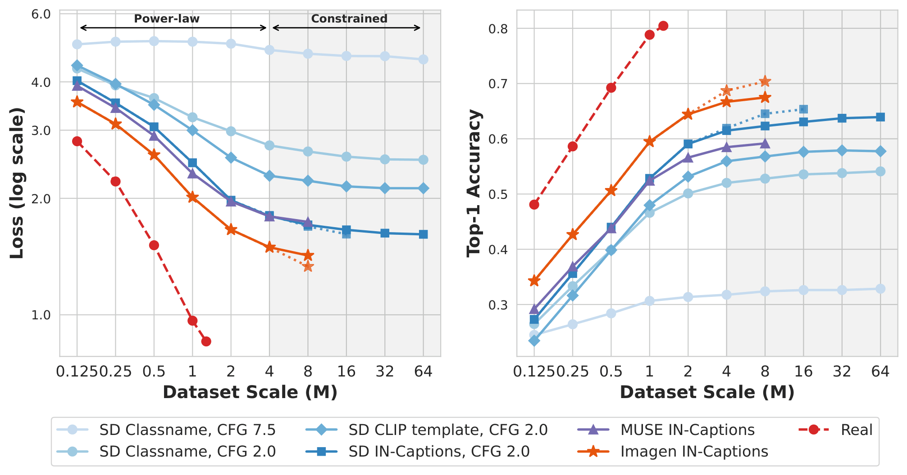
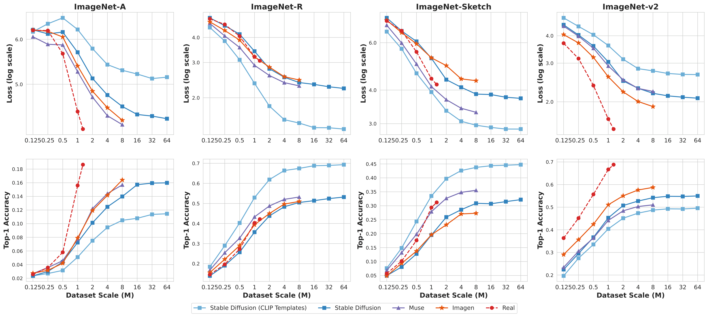

## Scaling Laws of Synthetic Images for Model Training ... for Now

**Link:** [https://arxiv.org/abs/2312.04567](https://arxiv.org/abs/2312.04567)  
**Authors:** [Lijie Fan](https://arxiv.org/search/cs?searchtype=author&query=Fan,+L), [Kaifeng Chen](https://arxiv.org/search/cs?searchtype=author&query=Chen,+K), [Dilip Krishnan](https://arxiv.org/search/cs?searchtype=author&query=Krishnan,+D), [Dina Katabi](https://arxiv.org/search/cs?searchtype=author&query=Katabi,+D), [Phillip Isola](https://arxiv.org/search/cs?searchtype=author&query=Isola,+P), [Yonglong Tian](https://arxiv.org/search/cs?searchtype=author&query=Tian,+Y)

## Problems
- Making supervised image classifiers / training models with language supervision like CLIP requires millions of images with manual annotation.
- Can current diffusion model's output images scale up training for classifiers?
## Findings
- Supervised classifiers underperform when synthetic data is scaled compared to real images. The reason for this is the failure of these models to generate certain concepts.
- CLIP style training is slightly worse than real images.
- Scaling synthetic data significantly improves out-of-distribution tests.
- For classifiers, some limitations are due to some classes being very difficult.
- Specific classes are too hard for the generative model to produce, which drives down overall accuracy of dataset and hence the training of models.
- Beyond 4 million images, to see losses go down, the standard models cannot keep up anymore. They need to increase the model size beyond 4 million image set.

## Figures

-   
This shows a plateau around 4M images.

-   
This shows the synthetic data loss curve is steeper than real data, particularly on ImageNet-R and ImageNet-Sketch (OOD).
