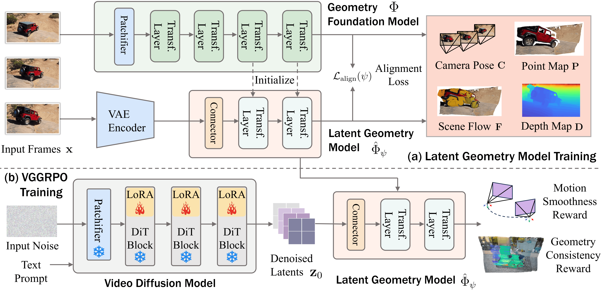

## VGGRPO

**Link:** https://arxiv.org/abs/2603.26599  
**Authors:** [Zhaochong An](https://arxiv.org/search/cs?searchtype=author&query=An,+Z), [Orest Kupyn](https://arxiv.org/search/cs?searchtype=author&query=Kupyn,+O), [Théo Uscidda](https://arxiv.org/search/cs?searchtype=author&query=Uscidda,+T), [Andrea Colaco](https://arxiv.org/search/cs?searchtype=author&query=Colaco,+A), [Karan Ahuja](https://arxiv.org/search/cs?searchtype=author&query=Ahuja,+K), [Serge Belongie](https://arxiv.org/search/cs?searchtype=author&query=Belongie,+S), [Mar Gonzalez-Franco](https://arxiv.org/search/cs?searchtype=author&query=Gonzalez-Franco,+M), [Marta Tintore Gazulla](https://arxiv.org/search/cs?searchtype=author&query=Gazulla,+M+T)  

## Problems

- Video diffusion struggles to preserve geometry.
- Existing geometry-aware approaches often improve results by:
  - adding extra modules
  - applying geometry-aware alignment
- Those methods can reduce generalizability.
- Reward computation often happens in pixel space, which requires VAE decoding and increases compute cost.
- Prior DPO or RL-style post-training methods typically rely on offline preference rewards.

## Potential Applications

- Embodied AI
- Physics simulations

## Core Idea

The paper proposes a latent geometry-guided framework for geometry-aware video post-training.

It introduces a latent geometry foundation model called *LGM*, which connects video diffusion latents with geometry foundation models.

The method uses **GRPO** in latent space with two complementary rewards:

- A camera motion smoothness reward to penalize jittery trajectories
- A geometry re-projection consistency reward to enforce cross-view geometric coherence

Overall methodology.
## Brief Method Explanation

- Input frames are processed by a geometry foundation model that operates in pixel space.
- The diffusion model's VAE latents are passed through a latent-space layer and aligned with the geometry representation using a distillation-style objective.
- LoRA layers are used for post-training fine-tuning.
- The denoised latent output is optimized with geometry-aware rewards.
